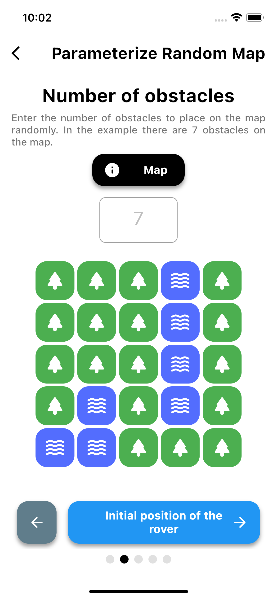

# Mars Rover Mission

The user will be able to input routes for the Rover to perform remotely in a generated 2D map. The user will be able to perform changes to a 7 x 7 map or to generate a random one through parameters.

## Data

### Input and Output

The user will place the Rover in an arbitrary 2D point, facing a certain direction, within a 2D map with N random obstacles. All these attributes will be selected by the user.

The user will command the Rover to move on the map through different sequential actions such as FRLLRFLLRRRL. The Rover will perform those actions in order and will result in 2 different outcomes:

- No obstacle found: the Rover completed the route perfectly without issues and the mission is completed.
- Obstacle found: the Rover encounter an obstacle and the route did not complete. The Rover will report the position of the obstacle and it will move to the last possible position (position when the obstacle was observed).

### Rover Actions

The Rover only understands 3 different actions: forward (F), right (R) or left (L).

This means that in order to go backwards, the Rover will have to perform two different actions.

### Rover Facing Directions

The Rover, as usual, will face 4 different directions: north (N), south (S), east (E) or west (W). 

The actions will have an impact depending on the direction the Rover is facing.

---

## Screenshots

### Static Map

The user will be given a 7 x 7 map and will be able to select the map tiles to place them in it in whatever order the user wants. Then the user will have to specify the rover actions based on the map he or she designed.

For this 7 x 7 map, a complete visualization of the steps the rover will take is provided: for every second, the rover will move on the map.

  
  
  
  

### Parametrized Map

Map dimensions, number of obstacles, intial rover position and direction, and actions are specified for the rover. All of these attributes come with an example below to guide user to enter the inputs.

As the map can be whatever size, the visualization is not done, but instead a step by step path sequence of the rover is given to the user.

  
  
  
  
  
  

---

## Developer

### Architecture

For the architecture, I have followed BLOC pattern, taking all the heavy loading away from the Widgets and managing states and events in a more complex and sophisticated way.

The whole algorithm for the rover actions is performed under bloc events and states to update the UI whenever the rover makes an action.

### Folder Structure

- `core`: where the localization, models, constants, types, routing helpers and the algorithm are located. Basically, non-UI directly related functions.
- `ui`: divided in `pages`, `theme` and `widgets`.
  
    - `pages`: where the UI pages are defined. Each page comes with its `bloc` folder to manage the state of its view.
    - `theme`: where the theme related `ThemeData` constants are defined.
    - `widgets`: where the generic widgets are gathered. These widgets are used all over the pages, thus making them reusable.
    - `utils.dart`: where generic UI helper functions are defined such as - snack bar show or `url_launcher` call.
  
- `test`: where the unit tests are defined.
- `integration_test`: where the integration tests are defined.

### Testing

In this project exhaustive unit and integration testing has been performed. Please, refer to `test` and `integration_test` folders respectively to see the tests.

In order to execute them run in the command line `> flutter test` for unit testing and `> flutter test integration_test` for integration testing with a phone emulator running.
